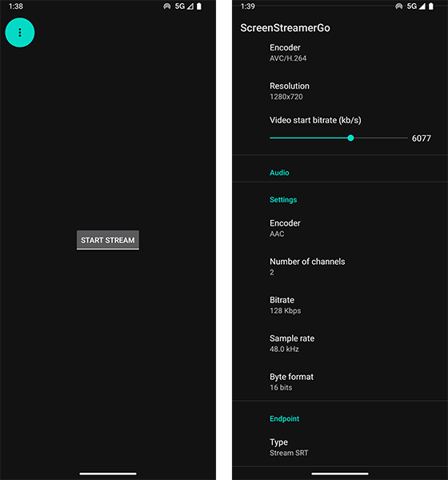

# ScreenStreamerGo - free Android screen sharing app

ScreenStreamerGo is a free Android app designed for screen sharing on the go based on [StreamPack SDK](https://github.com/ThibaultBee/StreamPack).

## Features

- Simple app to stream your phone screen via SRT or RTMP protocols.
- Can use SRTLA bonding via [Bond Bunny](https://github.com/dimadesu/bond-bunny) app.
- It's based on the StreamPack screen sharing demo app. See StreamPack feature list [here](https://github.com/ThibaultBee/StreamPack?tab=readme-ov-file#features).

### Roadmap
- :x: Add dynamic/adaptive bitrate algorithms from [Belabox](https://belabox.net/) ant/or [Moblin](https://github.com/eerimoq/moblin).
- :x: Aggressive infinite reconnect when app loses connection.

Share ideas or report issues in Discord https://discord.gg/2UzEkU2AJW or create Git issues.

## How to install

### GitHub releases

I plan releasing .apk files using [GitHub releases](https://github.com/dimadesu/ScreenStreamerGo/releases).

Open [GitHub releases page](https://github.com/dimadesu/ScreenStreamerGo/releases) on your phone, download .apk file and install.

## Project goals

There are already existing screen sharing apps on Android. They want to charge money for this, so they make free functionality somehow limited.

This project simply allows getting doing the same for free. It's all open source and legit.

## Related projects

- [LifeStreamer](https://github.com/dimadesu/LifeStreamer) - Android IRL live streaming app - use device cameras, RTMP, SRT, USB as sources + HEVC + SRT + adaptive bitrate.
- [Bond Bunny](https://github.com/dimadesu/bond-bunny) - Android SRTLA bonding app. Add SRTLA bonding to any SRT stream.
- [MediaSrvr](https://github.com/dimadesu/MediaSrvr) - run RTMP media server as Android app.

